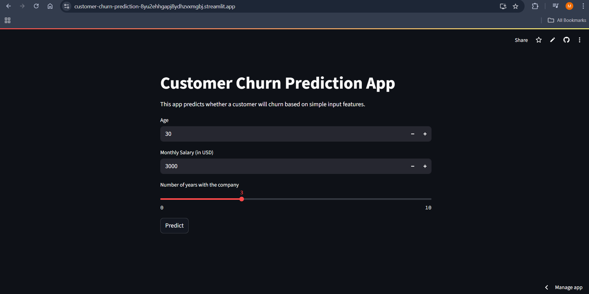

# Customer Churn Prediction App

A simple Streamlit app that predicts customer churn using Machine Learning.

## 🚀 Live Demo:
[Click here to view the deployed app!](https://customer-churn-prediction-8yu2ehhgapj8ydhzvxmgbj.streamlit.app/)

## Features:
- Predicts customer churn based on input features like age, salary, and years with the company.
- Built using Python, Pandas, Scikit-Learn, and Streamlit.
- Deployed on Streamlit Cloud.

## How to Run Locally:
1. Clone the repository:
git clone https://github.com/Manat-Garg/customer-churn-prediction.git
cd customer-churn-prediction
2. Install dependencies:
pip install -r requirements.txt
3. Run the app:
streamlit run app.py

---

✅ After updating — click **Commit changes**.

Tell me when done — I’ll check & give you the **final polishing step for recruiters!** 😊

